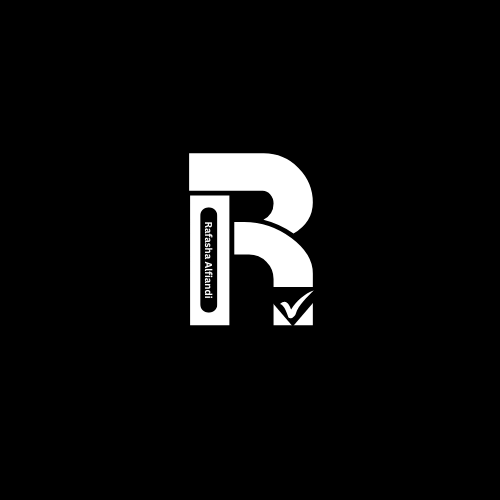

# Halo! Saya [Rafasha Alfiandi] 🚀

  

  

## 👨‍💻 Tentang Saya

Halo! Saya adalah seorang **Programmer** & **Content Creator** yang bersemangat dalam membangun sesuatu yang luar biasa dan berbagi pengetahuan dengan dunia. Saya mengkhususkan diri dalam **pengembangan web, rekayasa perangkat lunak, dan menciptakan konten menarik** untuk membantu orang lain belajar dan berkembang. 🌟

- 🎥 Saya membuat tutorial coding dan konten teknologi di [YouTube](https://youtube.com/Rafashaalfiandi)
- 💡 Saya berbagi wawasan, tips, dan trik tentang pemrograman dan pengembangan
- 🚀 Selalu belajar dan mengeksplorasi teknologi baru

---

## 🔧 Teknologi & Alat

  

## 💻 Bahasa Pemrograman

  

---

## 📊 Statistik GitHub

  
  
  
  

---

## 🎬 Video YouTube Terbaru
✅ [Membuat Website Animasi Kubus/kotak dengan HTML (tutorial html)](https://youtu.be/NJMbFQfho8o?si=O9A4hdjwdKsUrKjC) 
✅ [Tutorial HTML, CSS, dan JavaScript: Membangun Kalkulator Responsif!](https://youtu.be/NJMbFQfho8o?si=pZMHyWt-hOYidQo0)

---

## 📣 Hubungi Saya
Jika ingin menghubungi saya secara langsung, bisa melalui:

  
  

---

## 🌐 Sosial Media
Tetap terhubung dan ikuti saya di berbagai platform berikut:

  
  
  
  

---

## 🚀 *"Ngoding dengan semangat, berkarya dengan tujuan!"*
